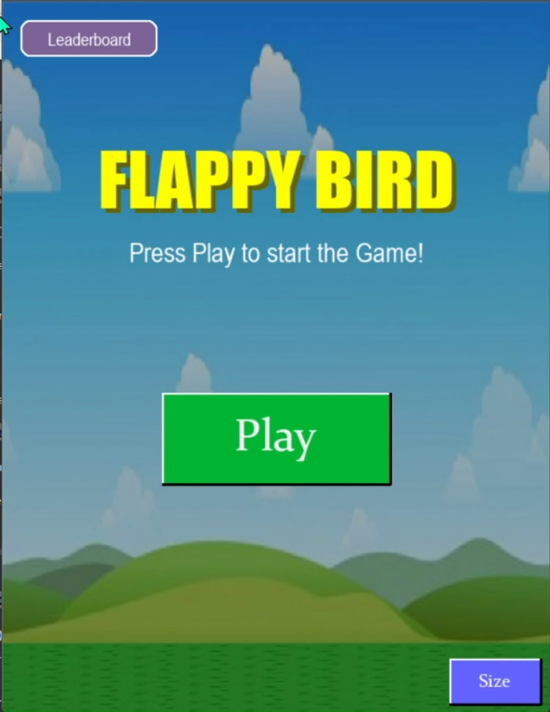
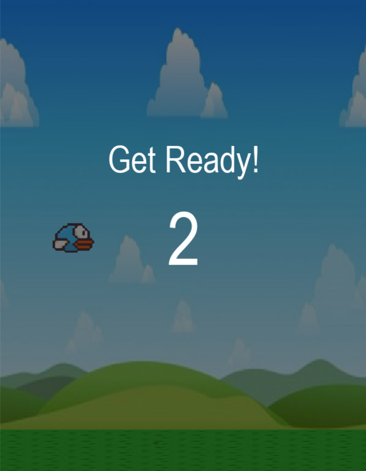
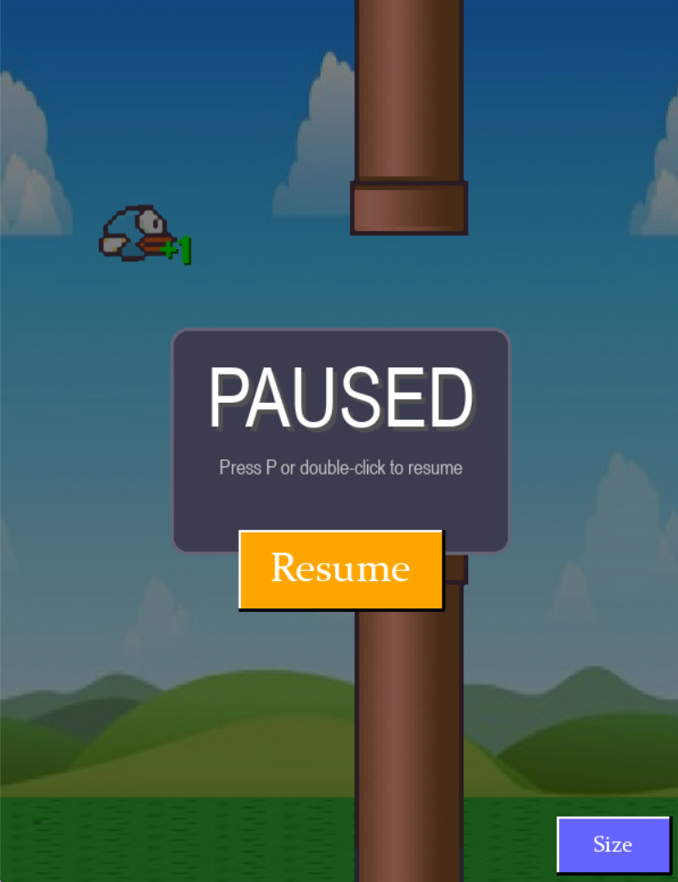
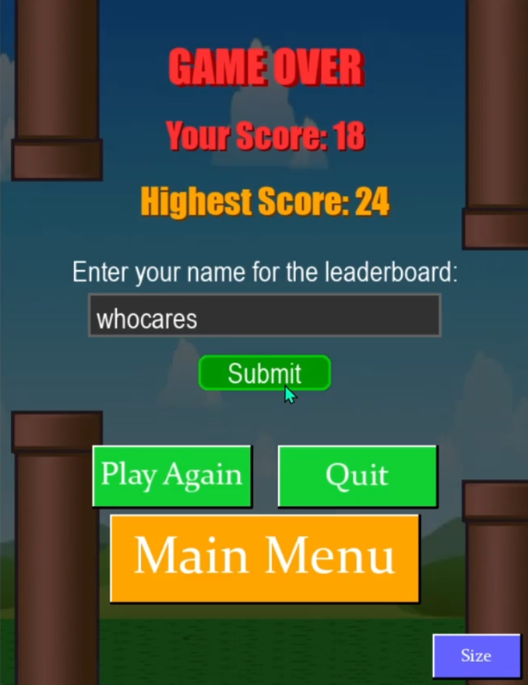
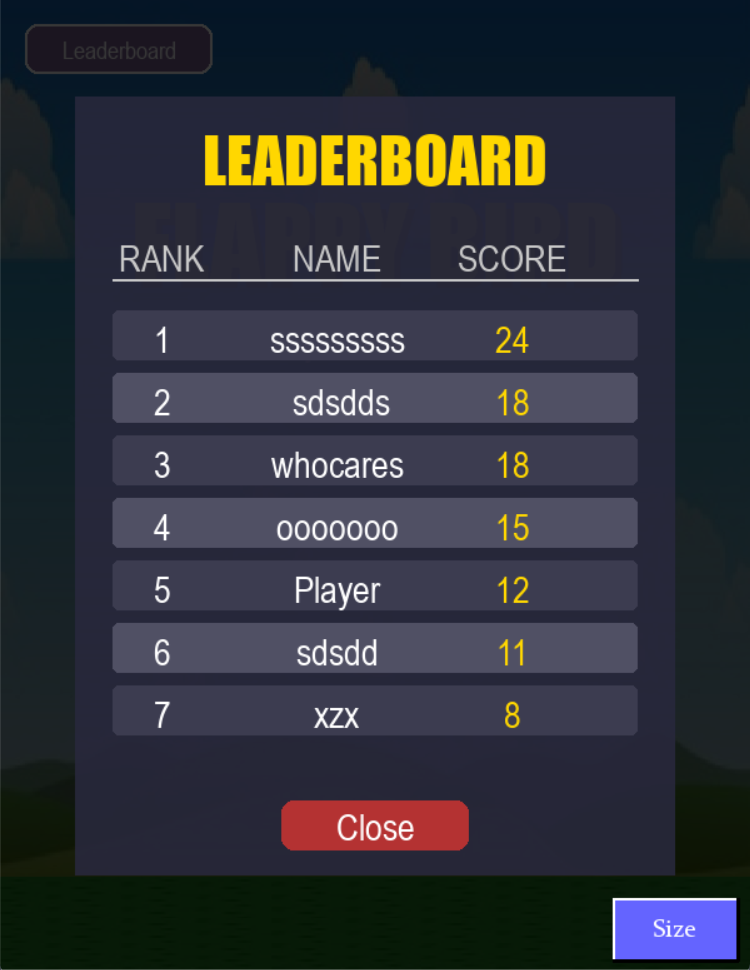

# 🕹️ Flappy Bird Clone – Gameplay Showcase

### Welcome to a visual walkthrough of the Flappy Bird-style game built with Pygame!  
#### Below you'll find screenshots and videos highlighting the core gameplay.

---

## 🎮 Start Screen

---

## 🏁 Get Ready Screen

---

## ⏸️ Pause Screen

---

## ☠️ Game Over Screen

---

## 🏆 LeaderBoard -- Accessible via button on Start Screen

---

## 🎥 [Gameplay Video (YouTube)](https://youtube.com/shorts/EqGxaboTEXA)

### Watch the full demo on YouTube

---

## 📁 Local Gameplay Video (Download / View Locally)

> #### If you're viewing this locally, you can watch the video below or download it.

<video width="480" controls>
  <source src="gameplay/gameplay.mp4" type="video/mp4">
  Your browser does not support the video tag.
</video>

[📥 Download Video](gameplay/gameplay.mp4)

---

## 📝 Notes

#### • Built with Python and Pygame
#### • Includes screen resizing, pause/resume, animated score messages, and a responsive UI
#### • Designed for smooth gameplay transitions between **Start**, **Get Ready**, **Play**, and **Game Over** states
